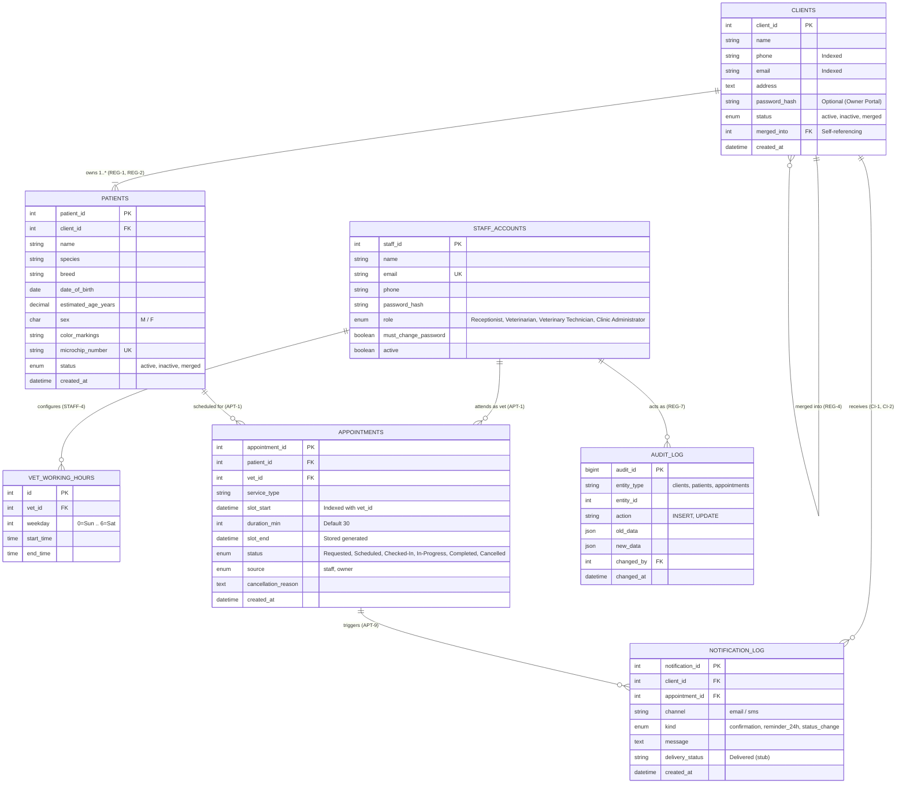

# Entity Relationship (ER) Diagram - VCMS
## Derived from SRS Appendix B.1 and Appendix B.2

```mermaid
erDiagram
    STAFF_ACCOUNTS ||--o{ VET_WORKING_HOURS : "configures (STAFF-4)"
    STAFF_ACCOUNTS ||--o{ APPOINTMENTS : "attends as vet (APT-1)"
    STAFF_ACCOUNTS ||--o{ AUDIT_LOG : "acts as (REG-7)"
    
    CLIENTS ||--|{ PATIENTS : "owns 1..* (REG-1, REG-2)"
    CLIENTS ||--o{ CLIENTS : "merged into (REG-4)"
    CLIENTS ||--o{ NOTIFICATION_LOG : "receives (CI-1, CI-2)"

    PATIENTS ||--o{ APPOINTMENTS : "scheduled for (APT-1)"

    APPOINTMENTS ||--o{ NOTIFICATION_LOG : "triggers (APT-9)"

    STAFF_ACCOUNTS {
        int staff_id PK
        string name
        string email UK
        string phone
        string password_hash
        enum role "Receptionist, Veterinarian, Veterinary Technician, Clinic Administrator"
        boolean must_change_password
        boolean active
    }

    VET_WORKING_HOURS {
        int id PK
        int vet_id FK
        int weekday "0=Sun .. 6=Sat"
        time start_time
        time end_time
    }

    CLIENTS {
        int client_id PK
        string name
        string phone "Indexed"
        string email "Indexed"
        text address
        string password_hash "Optional (Owner Portal)"
        enum status "active, inactive, merged"
        int merged_into FK "Self-referencing"
        datetime created_at
    }

    PATIENTS {
        int patient_id PK
        int client_id FK
        string name
        string species
        string breed
        date date_of_birth
        decimal estimated_age_years
        char sex "M / F"
        string color_markings
        string microchip_number UK
        enum status "active, inactive, merged"
        datetime created_at
    }

    APPOINTMENTS {
        int appointment_id PK
        int patient_id FK
        int vet_id FK
        string service_type
        datetime slot_start "Indexed with vet_id"
        int duration_min "Default 30"
        datetime slot_end "Stored generated"
        enum status "Requested, Scheduled, Checked-In, In-Progress, Completed, Cancelled"
        enum source "staff, owner"
        text cancellation_reason
        datetime created_at
    }

    AUDIT_LOG {
        bigint audit_id PK
        string entity_type "clients, patients, appointments"
        int entity_id
        string action "INSERT, UPDATE"
        json old_data
        json new_data
        int changed_by FK
        datetime changed_at
    }

    NOTIFICATION_LOG {
        int notification_id PK
        int client_id FK
        int appointment_id FK
        string channel "email / sms"
        enum kind "confirmation, reminder_24h, status_change"
        text message
        string delivery_status "Delivered (stub)"
        datetime created_at
    }
```
